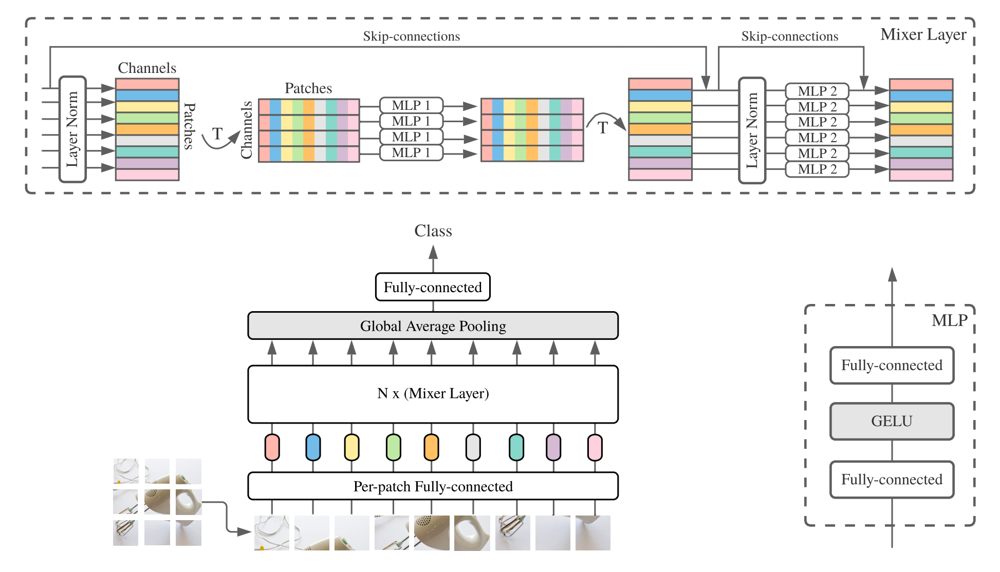

# Vision Transformer and MLP-Mixer Architectures

**Update (9.6.2022)**: Added the ResNet, ViT, and MLP-Mixer checkpoints
optimized using "Surrogate Gap Minimization Improves Sharpness-Aware Training"
(a.k.a. GSAM) paper (Table 1).

**Update (14.4.2022)**: Added models and Colab for [LiT models](#lit-models).

**Update (2.7.2021)**: Added the "When Vision Transformers Outperform
ResNets..." paper, and [SAM](https://arxiv.org/abs/2010.01412)
(Sharpness-Aware Minimization) optimized ViT and MLP-Mixer checkpoints.

**Update (20.6.2021)**: Added the "How to train your ViT? ..." paper, and a new
Colab to explore the >50k pre-trained and fine-tuned checkpoints mentioned in
the paper.

**Update (18.6.2021)**: This repository was rewritten to use Flax Linen API and
`ml_collections.ConfigDict` for configuration.

In this repository we release models from the papers

- [An Image is Worth 16x16 Words: Transformers for Image Recognition at Scale](https://arxiv.org/abs/2010.11929)
- [MLP-Mixer: An all-MLP Architecture for Vision](https://arxiv.org/abs/2105.01601)
- [How to train your ViT? Data, Augmentation, and Regularization in Vision Transformers](https://arxiv.org/abs/2106.10270)
- [When Vision Transformers Outperform ResNets without Pretraining or Strong Data Augmentations](https://arxiv.org/abs/2106.01548)
- [Surrogate Gap Minimization Improves Sharpness-Aware Training](https://arxiv.org/abs/2203.08065)

The models were pre-trained on the [ImageNet](http://www.image-net.org/) and
[ImageNet-21k](http://www.image-net.org/) datasets. We provide the code for
fine-tuning the released models in
[JAX](https://jax.readthedocs.io)/[Flax](http://flax.readthedocs.io).

Table of contents:

- [Vision Transformer and MLP-Mixer Architectures](#vision-transformer-and-mlp-mixer-architectures)
	- [Colab](#colab)
	- [Installation](#installation)
	- [Fine-tuning a model](#fine-tuning-a-model)
	- [Vision Transformer](#vision-transformer)
		- [Available ViT models](#available-vit-models)
		- [Expected ViT results](#expected-vit-results)
	- [MLP-Mixer](#mlp-mixer)
		- [Available Mixer models](#available-mixer-models)
		- [Expected Mixer results](#expected-mixer-results)
  - [LiT models](#lit-models)
	- [Running on cloud](#running-on-cloud)
		- [Create a VM](#create-a-vm)
		- [Setup VM](#setup-vm)
	- [Bibtex](#bibtex)
	- [Disclaimers](#disclaimers)


## Colab

Below Colabs run both with GPUs, and TPUs (8 cores, data parallelism).

The first Colab demonstrates the JAX code of Vision Transformers and MLP Mixers.
This Colab allows you to edit the files from the repository directly in the
Colab UI and has annotated Colab cells that walk you through the code step by
step, and lets you interact with the data.

https://colab.research.google.com/github/google-research/vision_transformer/blob/main/vit_jax.ipynb

The second Colab allows you to explore the >50k Vision Transformer and hybrid
checkpoints that were used to generate the data of the third paper "How to train
your ViT? ...". The Colab includes code to explore and select checkpoints, and
to do inference both using the JAX code from this repo, and also using the
popular [`timm`] PyTorch library that can directly load these checkpoints as
well. Note that a handful of models are also available directly from TF-Hub:
[sayakpaul/collections/vision_transformer] (external contribution by [Sayak
Paul]).

The second Colab also lets you fine-tune the checkpoints on any tfds dataset
and your own dataset with examples in individual JPEG files (optionally directly
reading from Google Drive).

https://colab.research.google.com/github/google-research/vision_transformer/blob/main/vit_jax_augreg.ipynb

**Note**: As for now (6/20/21) Google Colab only supports a single GPU (Nvidia
Tesla T4), and TPUs (currently TPUv2-8) are attached indirectly to the Colab VM
and communicate over slow network, which leads to pretty bad training speed. You
would usually want to set up a dedicated machine if you have a non-trivial
amount of data to fine-tune on. For details see the
[Running on cloud](#running-on-cloud) section.


[`timm`]: https://github.com/rwightman/pytorch-image-models
[sayakpaul/collections/vision_transformer]: https://tfhub.dev/sayakpaul/collections/vision_transformer
[Sayak Paul]: https://github.com/sayakpaul


## Installation

Make sure you have `Python>=3.6` installed on your machine.

Install JAX and python dependencies by running:
```
# If using GPU:
pip install -r vit_jax/requirements.txt

# If using TPU:
pip install -r vit_jax/requirements-tpu.txt
```
For newer versions of [JAX](https://github.com/google/jax), follow the instructions
provided in the corresponding repository linked here. Note that installation
instructions for CPU, GPU and TPU differs slightly.

Install [Flaxformer](https://github.com/google/flaxformer), follow the instructions
provided in the corresponding repository linked here.

For more details refer to the section [Running on cloud](#running-on-cloud)
below.


## Fine-tuning a model

You can run fine-tuning of the downloaded model on your dataset of interest. All
models share the same command line interface.

For example for fine-tuning a ViT-B/16 (pre-trained on imagenet21k) on CIFAR10
(note how we specify `b16,cifar10` as arguments to the config, and how we
instruct the code to access the models directly from a GCS bucket instead of
first downloading them into the local directory):

```bash
python -m vit_jax.main --workdir=/tmp/vit-$(date +%s) \
    --config=$(pwd)/vit_jax/configs/vit.py:b16,cifar10 \
    --config.pretrained_dir='gs://vit_models/imagenet21k'
```

In order to fine-tune a Mixer-B/16 (pre-trained on imagenet21k) on CIFAR10:

```bash
python -m vit_jax.main --workdir=/tmp/vit-$(date +%s) \
    --config=$(pwd)/vit_jax/configs/mixer_base16_cifar10.py \
    --config.pretrained_dir='gs://mixer_models/imagenet21k'
```

The "How to train your ViT? ..." paper added >50k checkpoints that you can
fine-tune with the [`configs/augreg.py`] config. When you only specify the model
name (the `config.name` value from [`configs/model.py`]), then the best i21k
checkpoint by upstream validation accuracy ("recommended" checkpoint, see
section 4.5 of the paper) is chosen. To make up your mind which model you want
to use, have a look at Figure 3 in the paper. It's also possible to choose a
different checkpoint (see Colab [`vit_jax_augreg.ipynb`]) and then specify the
value from the `filename` or `adapt_filename` column, which correspond to the
filenames without `.npz` from the [`gs://vit_models/augreg`] directory.

```bash
python -m vit_jax.main --workdir=/tmp/vit-$(date +%s) \
    --config=$(pwd)/vit_jax/configs/augreg.py:R_Ti_16 \
    --config.dataset=oxford_iiit_pet \
    --config.base_lr=0.01
```

Currently, the code will automatically download CIFAR-10 and CIFAR-100 datasets.
Other public or custom datasets can be easily integrated, using [tensorflow
datasets library](https://github.com/tensorflow/datasets/). Note that you will
also need to update `vit_jax/input_pipeline.py` to specify some parameters about
any added dataset.

Note that our code uses all available GPUs/TPUs for fine-tuning.

To see a detailed list of all available flags, run `python3 -m vit_jax.train
--help`.

Notes on memory:

- Different models require different amount of memory. Available memory also
  depends on the accelerator configuration (both type and count). If you
  encounter an out-of-memory error you can increase the value of
  `--config.accum_steps=8` -- alternatively, you could also decrease the
  `--config.batch=512` (and decrease `--config.base_lr` accordingly).
- The host keeps a shuffle buffer in memory. If you encounter a host OOM (as
  opposed to an accelerator OOM), you can decrease the default
  `--config.shuffle_buffer=50000`.


[`configs/augreg.py`]: https://github.com/google-research/vision_transformer/blob/main/vit_jax/configs/augreg.py
[`configs/model.py`]: https://github.com/google-research/vision_transformer/blob/main/vit_jax/configs/models.py
[`vit_jax_augreg.ipynb`]: https://colab.research.google.com/github/google-research/vision_transformer/blob/main/vit_jax_augreg.ipynb
[`gs://vit_models/augreg`]: https://console.cloud.google.com/storage/browser/vit_models/augreg/
[`vit_jax.ipynb`]: https://colab.research.google.com/github/google-research/vision_transformer/blob/main/vit_jax.ipynb
[`gs://vit_models/sam`]: https://console.cloud.google.com/storage/browser/vit_models/sam/
[`gs://mixer_models/sam`]: https://console.cloud.google.com/storage/mixer_models/sam/
[`gs://vit_models/gsam`]: https://console.cloud.google.com/storage/browser/vit_models/gsam/
[`gs://mixer_models/gsam`]: https://console.cloud.google.com/storage/mixer_models/gsam/

## Vision Transformer

by Alexey Dosovitskiy\*†, Lucas Beyer\*, Alexander Kolesnikov\*, Dirk
Weissenborn\*, Xiaohua Zhai\*, Thomas Unterthiner, Mostafa Dehghani, Matthias
Minderer, Georg Heigold, Sylvain Gelly, Jakob Uszkoreit and Neil Houlsby\*†.

(\*) equal technical contribution, (†) equal advising.


Overview of the model: we split an image into fixed-size patches, linearly embed
each of them, add position embeddings, and feed the resulting sequence of
vectors to a standard Transformer encoder. In order to perform classification,
we use the standard approach of adding an extra learnable "classification token"
to the sequence.

### Available ViT models

We provide models pre-trained on ImageNet-21k for the following architectures:
ViT-B/16, ViT-B/32, ViT-L/16 and ViT-L/32. We  provide the same models
pre-trained on ImageNet-21k *and* fine-tuned on ImageNet.

**Update (9.6.2022)**: We added the ViT models trained from scratch using
[GSAM](https://arxiv.org/abs/2203.08065) on ImageNet without strong data
augmentations. The resultant ViTs outperform those of similar sizes trained
using AdamW optimizer or the original [SAM](https://arxiv.org/abs/2010.01412)
algorithm, or with strong data augmentations.
To use those models, you can simply replace the model path
in [`vit_jax.ipynb`] with [`gs://vit_models/gsam`].

**Update (29.7.2021)**: Added ViT-B/8 AugReg models (3 upstream checkpoints and
adaptations with resolution=224).

**Update (2.7.2021)**: We added the ViT models trained from scratch with 
[SAM](https://arxiv.org/abs/2010.01412) optimizer on ImageNet 
(with basic Inception-style preprocessing). The resultant ViTs outperform 
ResNets of similar size and throughput without large-scale pre-training or 
strong data augmentations. They also possess more perceptive attention maps. 
To use those models, you can simply replace the model path 
in [`vit_jax.ipynb`] with [`gs://vit_models/sam`].

**Update (19.5.2021)**: With publication of the "How to train your ViT? ..."
paper, we added more than 50k ViT and hybrid models pre-trained on ImageNet and
ImageNet-21k with various degrees of data augmentation and model regularization,
and fine-tuned on ImageNet, Pets37, Kitti-distance, CIFAR-100, and Resisc45.
Check out [`vit_jax_augreg.ipynb`] to navigate this treasure trove of models!
For example, you can use that Colab to fetch the filenames of recommended
pre-trained and fine-tuned checkpoints from the `i21k_300` column of Table 3 in
the paper:

|  Model   |                                   Pre-trained checkpoint                                   |   Size   |                                                       Fine-tuned checkpoint                                                        | Resolution | Img/sec | Imagenet accuracy |
| :------- | :----------------------------------------------------------------------------------------- | -------: | :--------------------------------------------------------------------------------------------------------------------------------- | ---------: | ------: | ----------------: |
| L/16     | `gs://vit_models/augreg/L_16-i21k-300ep-lr_0.001-aug_strong1-wd_0.1-do_0.0-sd_0.0.npz`     | 1243 MiB | `gs://vit_models/augreg/L_16-i21k-300ep-lr_0.001-aug_strong1-wd_0.1-do_0.0-sd_0.0--imagenet2012-steps_20k-lr_0.01-res_384.npz`     |        384 |      50 |            85.59% |
| B/16     | `gs://vit_models/augreg/B_16-i21k-300ep-lr_0.001-aug_medium1-wd_0.1-do_0.0-sd_0.0.npz`     |  391 MiB | `gs://vit_models/augreg/B_16-i21k-300ep-lr_0.001-aug_medium1-wd_0.1-do_0.0-sd_0.0--imagenet2012-steps_20k-lr_0.03-res_384.npz`     |        384 |     138 |            85.49% |
| S/16     | `gs://vit_models/augreg/S_16-i21k-300ep-lr_0.001-aug_light1-wd_0.03-do_0.0-sd_0.0.npz`     |  115 MiB | `gs://vit_models/augreg/S_16-i21k-300ep-lr_0.001-aug_light1-wd_0.03-do_0.0-sd_0.0--imagenet2012-steps_20k-lr_0.03-res_384.npz`     |        384 |     300 |            83.73% |
| R50+L/32 | `gs://vit_models/augreg/R50_L_32-i21k-300ep-lr_0.001-aug_medium1-wd_0.1-do_0.1-sd_0.1.npz` | 1337 MiB | `gs://vit_models/augreg/R50_L_32-i21k-300ep-lr_0.001-aug_medium1-wd_0.1-do_0.1-sd_0.1--imagenet2012-steps_20k-lr_0.01-res_384.npz` |        384 |     327 |            85.99% |
| R26+S/32 | `gs://vit_models/augreg/R26_S_32-i21k-300ep-lr_0.001-aug_light1-wd_0.1-do_0.0-sd_0.0.npz`  |  170 MiB | `gs://vit_models/augreg/R26_S_32-i21k-300ep-lr_0.001-aug_light1-wd_0.1-do_0.0-sd_0.0--imagenet2012-steps_20k-lr_0.01-res_384.npz`  |        384 |     560 |            83.85% |
| Ti/16    | `gs://vit_models/augreg/Ti_16-i21k-300ep-lr_0.001-aug_none-wd_0.03-do_0.0-sd_0.0.npz`      |   37 MiB | `gs://vit_models/augreg/Ti_16-i21k-300ep-lr_0.001-aug_none-wd_0.03-do_0.0-sd_0.0--imagenet2012-steps_20k-lr_0.03-res_384.npz`      |        384 |     610 |            78.22% |
| B/32     | `gs://vit_models/augreg/B_32-i21k-300ep-lr_0.001-aug_light1-wd_0.1-do_0.0-sd_0.0.npz`      |  398 MiB | `gs://vit_models/augreg/B_32-i21k-300ep-lr_0.001-aug_light1-wd_0.1-do_0.0-sd_0.0--imagenet2012-steps_20k-lr_0.01-res_384.npz`      |        384 |     955 |            83.59% |
| S/32     | `gs://vit_models/augreg/S_32-i21k-300ep-lr_0.001-aug_none-wd_0.1-do_0.0-sd_0.0.npz`        |  118 MiB | `gs://vit_models/augreg/S_32-i21k-300ep-lr_0.001-aug_none-wd_0.1-do_0.0-sd_0.0--imagenet2012-steps_20k-lr_0.01-res_384.npz`        |        384 |    2154 |            79.58% |
| R+Ti/16  | `gs://vit_models/augreg/R_Ti_16-i21k-300ep-lr_0.001-aug_none-wd_0.03-do_0.0-sd_0.0.npz`    |   40 MiB | `gs://vit_models/augreg/R_Ti_16-i21k-300ep-lr_0.001-aug_none-wd_0.03-do_0.0-sd_0.0--imagenet2012-steps_20k-lr_0.03-res_384.npz`    |        384 |    2426 |            75.40% |

**Update (1.12.2020)**: We have added the R50+ViT-B/16 hybrid model (ViT-B/16 on
top of a Resnet-50 backbone). When pretrained on imagenet21k, this model
achieves almost the performance of the L/16 model with less than half the
computational finetuning cost. Note that "R50" is somewhat modified for the B/16
variant: The original ResNet-50 has [3,4,6,3] blocks, each reducing the
resolution of the image by a factor of two. In combination with the ResNet stem
this would result in a reduction of 32x so even with a patch size of (1,1) the
ViT-B/16 variant cannot be realized anymore. For this reason we instead use
[3,4,9] blocks for the R50+B/16 variant.

**Update (9.11.2020)**: We have also added the ViT-L/16 model.

**Update (29.10.2020)**: We have added ViT-B/16 and ViT-L/16 models pretrained
on ImageNet-21k and then fine-tuned on ImageNet at 224x224 resolution (instead
of default 384x384). These models have the suffix "-224" in their name.
They are expected to achieve 81.2% and 82.7% top-1 accuracies respectively.

You can find all these models in the following storage bucket:

https://console.cloud.google.com/storage/browser/vit_models/

For example, if you would like to download the ViT-B/16 pre-trained on
imagenet21k run the following command:

```
wget https://storage.googleapis.com/vit_models/imagenet21k/ViT-B_16.npz
```

### Expected ViT results

Table below runs experiments both with `transformer.dropout_rate=0.1` (as in the
ViT paper), and with `transformer.dropout_rate=0.0`, which improves results
somewhat for models B=16, B/32, and L/32. The better setting was chosen for the
default config of the models in this repository. Note also that all these models
have `representation_size=None`, i.e. the last layer before the classification
layer is dropped for fine-tuning.


| model        | dataset      | dropout=0.0                                                                                                                                                         | dropout=0.1                                                                                                                                                          |
|:-------------|:-------------|:--------------------------------------------------------------------------------------------------------------------------------------------------------------------|:---------------------------------------------------------------------------------------------------------------------------------------------------------------------|
| R50+ViT-B_16 | cifar10      | 98.72%, 3.9h (A100), [tb.dev](https://tensorboard.dev/experiment/nwXQNjudRJW3dtQzhPZwwA/#scalars&regexInput=%5ER50.ViT-B_16/cifar10/do_0.0&_smoothingWeight=0)      | 98.94%, 10.1h (V100), [tb.dev](https://tensorboard.dev/experiment/nwXQNjudRJW3dtQzhPZwwA/#scalars&regexInput=%5ER50.ViT-B_16/cifar10/do_0.1&_smoothingWeight=0)      |
| R50+ViT-B_16 | cifar100     | 90.88%, 4.1h (A100), [tb.dev](https://tensorboard.dev/experiment/nwXQNjudRJW3dtQzhPZwwA/#scalars&regexInput=%5ER50.ViT-B_16/cifar100/do_0.0&_smoothingWeight=0)     | 92.30%, 10.1h (V100), [tb.dev](https://tensorboard.dev/experiment/nwXQNjudRJW3dtQzhPZwwA/#scalars&regexInput=%5ER50.ViT-B_16/cifar100/do_0.1&_smoothingWeight=0)     |
| R50+ViT-B_16 | imagenet2012 | 83.72%, 9.9h (A100), [tb.dev](https://tensorboard.dev/experiment/nwXQNjudRJW3dtQzhPZwwA/#scalars&regexInput=%5ER50.ViT-B_16/imagenet2012/do_0.0&_smoothingWeight=0) | 85.08%, 24.2h (V100), [tb.dev](https://tensorboard.dev/experiment/nwXQNjudRJW3dtQzhPZwwA/#scalars&regexInput=%5ER50.ViT-B_16/imagenet2012/do_0.1&_smoothingWeight=0) |
| ViT-B_16     | cifar10      | 99.02%, 2.2h (A100), [tb.dev](https://tensorboard.dev/experiment/nwXQNjudRJW3dtQzhPZwwA/#scalars&regexInput=%5EViT-B_16/cifar10/do_0.0&_smoothingWeight=0)          | 98.76%, 7.8h (V100), [tb.dev](https://tensorboard.dev/experiment/nwXQNjudRJW3dtQzhPZwwA/#scalars&regexInput=%5EViT-B_16/cifar10/do_0.1&_smoothingWeight=0)           |
| ViT-B_16     | cifar100     | 92.06%, 2.2h (A100), [tb.dev](https://tensorboard.dev/experiment/nwXQNjudRJW3dtQzhPZwwA/#scalars&regexInput=%5EViT-B_16/cifar100/do_0.0&_smoothingWeight=0)         | 91.92%, 7.8h (V100), [tb.dev](https://tensorboard.dev/experiment/nwXQNjudRJW3dtQzhPZwwA/#scalars&regexInput=%5EViT-B_16/cifar100/do_0.1&_smoothingWeight=0)          |
| ViT-B_16     | imagenet2012 | 84.53%, 6.5h (A100), [tb.dev](https://tensorboard.dev/experiment/nwXQNjudRJW3dtQzhPZwwA/#scalars&regexInput=%5EViT-B_16/imagenet2012/do_0.0&_smoothingWeight=0)     | 84.12%, 19.3h (V100), [tb.dev](https://tensorboard.dev/experiment/nwXQNjudRJW3dtQzhPZwwA/#scalars&regexInput=%5EViT-B_16/imagenet2012/do_0.1&_smoothingWeight=0)     |
| ViT-B_32     | cifar10      | 98.88%, 0.8h (A100), [tb.dev](https://tensorboard.dev/experiment/nwXQNjudRJW3dtQzhPZwwA/#scalars&regexInput=%5EViT-B_32/cifar10/do_0.0&_smoothingWeight=0)          | 98.75%, 1.8h (V100), [tb.dev](https://tensorboard.dev/experiment/nwXQNjudRJW3dtQzhPZwwA/#scalars&regexInput=%5EViT-B_32/cifar10/do_0.1&_smoothingWeight=0)           |
| ViT-B_32     | cifar100     | 92.31%, 0.8h (A100), [tb.dev](https://tensorboard.dev/experiment/nwXQNjudRJW3dtQzhPZwwA/#scalars&regexInput=%5EViT-B_32/cifar100/do_0.0&_smoothingWeight=0)         | 92.05%, 1.8h (V100), [tb.dev](https://tensorboard.dev/experiment/nwXQNjudRJW3dtQzhPZwwA/#scalars&regexInput=%5EViT-B_32/cifar100/do_0.1&_smoothingWeight=0)          |
| ViT-B_32     | imagenet2012 | 81.66%, 3.3h (A100), [tb.dev](https://tensorboard.dev/experiment/nwXQNjudRJW3dtQzhPZwwA/#scalars&regexInput=%5EViT-B_32/imagenet2012/do_0.0&_smoothingWeight=0)     | 81.31%, 4.9h (V100), [tb.dev](https://tensorboard.dev/experiment/nwXQNjudRJW3dtQzhPZwwA/#scalars&regexInput=%5EViT-B_32/imagenet2012/do_0.1&_smoothingWeight=0)      |
| ViT-L_16     | cifar10      | 99.13%, 6.9h (A100), [tb.dev](https://tensorboard.dev/experiment/nwXQNjudRJW3dtQzhPZwwA/#scalars&regexInput=%5EViT-L_16/cifar10/do_0.0&_smoothingWeight=0)          | 99.14%, 24.7h (V100), [tb.dev](https://tensorboard.dev/experiment/nwXQNjudRJW3dtQzhPZwwA/#scalars&regexInput=%5EViT-L_16/cifar10/do_0.1&_smoothingWeight=0)          |
| ViT-L_16     | cifar100     | 92.91%, 7.1h (A100), [tb.dev](https://tensorboard.dev/experiment/nwXQNjudRJW3dtQzhPZwwA/#scalars&regexInput=%5EViT-L_16/cifar100/do_0.0&_smoothingWeight=0)         | 93.22%, 24.4h (V100), [tb.dev](https://tensorboard.dev/experiment/nwXQNjudRJW3dtQzhPZwwA/#scalars&regexInput=%5EViT-L_16/cifar100/do_0.1&_smoothingWeight=0)         |
| ViT-L_16     | imagenet2012 | 84.47%, 16.8h (A100), [tb.dev](https://tensorboard.dev/experiment/nwXQNjudRJW3dtQzhPZwwA/#scalars&regexInput=%5EViT-L_16/imagenet2012/do_0.0&_smoothingWeight=0)    | 85.05%, 59.7h (V100), [tb.dev](https://tensorboard.dev/experiment/nwXQNjudRJW3dtQzhPZwwA/#scalars&regexInput=%5EViT-L_16/imagenet2012/do_0.1&_smoothingWeight=0)     |
| ViT-L_32     | cifar10      | 99.06%, 1.9h (A100), [tb.dev](https://tensorboard.dev/experiment/nwXQNjudRJW3dtQzhPZwwA/#scalars&regexInput=%5EViT-L_32/cifar10/do_0.0&_smoothingWeight=0)          | 99.09%, 6.1h (V100), [tb.dev](https://tensorboard.dev/experiment/nwXQNjudRJW3dtQzhPZwwA/#scalars&regexInput=%5EViT-L_32/cifar10/do_0.1&_smoothingWeight=0)           |
| ViT-L_32     | cifar100     | 93.29%, 1.9h (A100), [tb.dev](https://tensorboard.dev/experiment/nwXQNjudRJW3dtQzhPZwwA/#scalars&regexInput=%5EViT-L_32/cifar100/do_0.0&_smoothingWeight=0)         | 93.34%, 6.2h (V100), [tb.dev](https://tensorboard.dev/experiment/nwXQNjudRJW3dtQzhPZwwA/#scalars&regexInput=%5EViT-L_32/cifar100/do_0.1&_smoothingWeight=0)          |
| ViT-L_32     | imagenet2012 | 81.89%, 7.5h (A100), [tb.dev](https://tensorboard.dev/experiment/nwXQNjudRJW3dtQzhPZwwA/#scalars&regexInput=%5EViT-L_32/imagenet2012/do_0.0&_smoothingWeight=0)     | 81.13%, 15.0h (V100), [tb.dev](https://tensorboard.dev/experiment/nwXQNjudRJW3dtQzhPZwwA/#scalars&regexInput=%5EViT-L_32/imagenet2012/do_0.1&_smoothingWeight=0)     |

We also would like to emphasize that high-quality results can be achieved with
shorter training schedules and encourage users of our code to play with
hyper-parameters to trade-off accuracy and computational budget.
Some examples for CIFAR-10/100 datasets are presented in the table below.

| upstream    | model    | dataset      | total_steps / warmup_steps  | accuracy | wall-clock time |                                                                         link |
| ----------- | -------- | ------------ | --------------------------- | -------- | --------------- | ---------------------------------------------------------------------------- |
| imagenet21k | ViT-B_16 | cifar10      | 500 / 50                    |   98.59% |             17m | [tensorboard.dev](https://tensorboard.dev/experiment/QgkpiW53RPmjkabe1ME31g/) |
| imagenet21k | ViT-B_16 | cifar10      | 1000 / 100                  |   98.86% |             39m | [tensorboard.dev](https://tensorboard.dev/experiment/w8DQkDeJTOqJW5js80gOQg/) |
| imagenet21k | ViT-B_16 | cifar100     | 500 / 50                    |   89.17% |             17m | [tensorboard.dev](https://tensorboard.dev/experiment/5hM4GrnAR0KEZg725Ewnqg/) |
| imagenet21k | ViT-B_16 | cifar100     | 1000 / 100                  |   91.15% |             39m | [tensorboard.dev](https://tensorboard.dev/experiment/QLQTaaIoT9uEcAjtA0eRwg/) |


## MLP-Mixer

by Ilya Tolstikhin\*, Neil Houlsby\*, Alexander Kolesnikov\*, Lucas Beyer\*,
Xiaohua Zhai, Thomas Unterthiner, Jessica Yung, Andreas Steiner, Daniel Keysers,
Jakob Uszkoreit, Mario Lucic, Alexey Dosovitskiy.

(\*) equal contribution.



MLP-Mixer (*Mixer* for short) consists of per-patch linear embeddings, Mixer
layers, and a classifier head. Mixer layers contain one token-mixing MLP and one
channel-mixing MLP, each consisting of two fully-connected layers and a GELU
nonlinearity. Other components include: skip-connections, dropout, and linear
classifier head.

For installation follow [the same steps](#installation) as above.

### Available Mixer models

**Update (9.6.2022)**: We added the MLP-Mixer models
([`gs://mixer_models/gsam`]) trained from scratch with
[GSAM](https://arxiv.org/abs/2203.08065) on ImageNet without strong
augmentations. The resultant MLP-Mixers outperform those of similar sizes
trained with AdamW optimizer or with the original
[SAM](https://arxiv.org/abs/2010.01412) algorithm.

**Update (2.7.2021)**: We added the MLP-Mixer models trained with 
[SAM](https://arxiv.org/abs/2010.01412) on ImageNet without strong 
augmentations ([`gs://mixer_models/sam`]). The loss landscapes become 
much smoother, and we found that the activated neurons for the 
first few layers decrease dramatically after SAM, 
indicating the potential redundency of image patches.

We provide the Mixer-B/16 and Mixer-L/16 models pre-trained on the ImageNet and
ImageNet-21k datasets. Details can be found in Table 3 of the Mixer paper. All
the models can be found at:

https://console.cloud.google.com/storage/mixer_models/

Note that these models are also available directly from TF-Hub:
[sayakpaul/collections/mlp-mixer] (external contribution by [Sayak
Paul]).

[sayakpaul/collections/mlp-mixer]: https://tfhub.dev/sayakpaul/collections/mlp-mixer

### Expected Mixer results

We ran the fine-tuning code on Google Cloud machine with four V100 GPUs with the
default adaption parameters from this repository. Here are the results:

upstream     | model      | dataset | accuracy | wall_clock_time | link
:----------- | :--------- | :------ | -------: | :-------------- | :---
ImageNet     | Mixer-B/16 | cifar10 | 96.72%   | 3.0h            | [tensorboard.dev](https://tensorboard.dev/experiment/j9zCYt9yQVm93nqnsDZayA/)
ImageNet     | Mixer-L/16 | cifar10 | 96.59%   | 3.0h            | [tensorboard.dev](https://tensorboard.dev/experiment/Q4feeErzRGGop5XzAvYj2g/)
ImageNet-21k | Mixer-B/16 | cifar10 | 96.82%   | 9.6h            | [tensorboard.dev](https://tensorboard.dev/experiment/mvP4McV2SEGFeIww20ie5Q/)
ImageNet-21k | Mixer-L/16 | cifar10 | 98.34%   | 10.0h           | [tensorboard.dev](https://tensorboard.dev/experiment/dolAJyQYTYmudytjalF6Jg/)


## LiT models

We have just published a post on the Google AI blog
[LiT: adding language understanding to image models](http://ai.googleblog.com/2022/04/locked-image-tuning-adding-language.html)
about our new CVPR paper "LiT: Zero-Shot Transfer with Locked-image text Tuning"
(https://arxiv.org/abs/2111.07991).

We provide a in-browser demo with small text encoders for interactive use (the
smallest models should even run on a modern cell phone):

https://google-research.github.io/vision_transformer/lit/

And finally a Colab to use the JAX models with both image and text encoders:

https://colab.research.google.com/github/google-research/vision_transformer/blob/main/lit.ipynb

Note that none of above models support multi-lingual inputs yet, but we're
working on publishing such models and will update this repository once they
become available.


## Running on cloud

While above [colabs](#colab) are pretty useful to get started, you would usually
want to train on a larger machine with more powerful accelerators.

### Create a VM

You can use the following commands to setup a VM with GPUs on Google Cloud:

```bash
# Set variables used by all commands below.
# Note that project must have accounting set up.
# For a list of zones with GPUs refer to
# https://cloud.google.com/compute/docs/gpus/gpu-regions-zones
PROJECT=my-awesome-gcp-project  # Project must have billing enabled.
VM_NAME=vit-jax-vm-gpu
ZONE=europe-west4-b

# Below settings have been tested with this repository. You can choose other
# combinations of images & machines (e.g.), refer to the corresponding gcloud commands:
# gcloud compute images list --project ml-images
# gcloud compute machine-types list
# etc.
gcloud compute instances create $VM_NAME \
    --project=$PROJECT --zone=$ZONE \
    --image=c1-deeplearning-tf-2-5-cu110-v20210527-debian-10 \
    --image-project=ml-images --machine-type=n1-standard-96 \
    --scopes=cloud-platform,storage-full --boot-disk-size=256GB \
    --boot-disk-type=pd-ssd --metadata=install-nvidia-driver=True \
    --maintenance-policy=TERMINATE \
    --accelerator=type=nvidia-tesla-v100,count=8

# Connect to VM (after some minutes needed to setup & start the machine).
gcloud compute ssh --project $PROJECT --zone $ZONE $VM_NAME

# Stop the VM after use (only storage is billed for a stopped VM).
gcloud compute instances stop --project $PROJECT --zone $ZONE $VM_NAME

# Delete VM after use (this will also remove all data stored on VM).
gcloud compute instances delete --project $PROJECT --zone $ZONE $VM_NAME
```

Alternatively, you can use the following similar commands to set up a Cloud VM
with TPUs attached to them (below commands copied from the [TPU tutorial]):

[TPU tutorial]: https://cloud.google.com/tpu/docs/jax-quickstart-tpu-vm

```bash
PROJECT=my-awesome-gcp-project  # Project must have billing enabled.
VM_NAME=vit-jax-vm-tpu
ZONE=europe-west4-a

# Required to set up service identity initially.
gcloud beta services identity create --service tpu.googleapis.com

# Create a VM with TPUs directly attached to it.
gcloud alpha compute tpus tpu-vm create $VM_NAME \
    --project=$PROJECT --zone=$ZONE \
    --accelerator-type v3-8 \
    --version tpu-vm-base

# Connect to VM (after some minutes needed to setup & start the machine).
gcloud alpha compute tpus tpu-vm ssh --project $PROJECT --zone $ZONE $VM_NAME

# Stop the VM after use (only storage is billed for a stopped VM).
gcloud alpha compute tpus tpu-vm stop --project $PROJECT --zone $ZONE $VM_NAME

# Delete VM after use (this will also remove all data stored on VM).
gcloud alpha compute tpus tpu-vm delete --project $PROJECT --zone $ZONE $VM_NAME
```

### Setup VM

And then fetch the repository and the install dependencies (including `jaxlib`
with TPU support) as usual:

```bash
git clone --depth=1 --branch=master https://github.com/google-research/vision_transformer
cd vision_transformer

# optional: install virtualenv
pip3 install virtualenv
python3 -m virtualenv env
. env/bin/activate
```

If you're connected to a VM with GPUs attached, install JAX and other dependencies with the following
command:

```bash
pip install -r vit_jax/requirements.txt
```

If you're connected to a VM with TPUs attached, install JAX and other dependencies with the following
command:

```bash
pip install -r vit_jax/requirements-tpu.txt
```

Install [Flaxformer](https://github.com/google/flaxformer), follow the instructions
provided in the corresponding repository linked here.

For both GPUs and TPUs, Check that JAX can connect to attached accelerators with the command:
```bash
python -c 'import jax; print(jax.devices())'
```

And finally execute one of the commands mentioned in the section
[fine-tuning a model](#fine-tuning-a-model).


## Bibtex

```
@article{dosovitskiy2020vit,
  title={An Image is Worth 16x16 Words: Transformers for Image Recognition at Scale},
  author={Dosovitskiy, Alexey and Beyer, Lucas and Kolesnikov, Alexander and Weissenborn, Dirk and Zhai, Xiaohua and Unterthiner, Thomas and  Dehghani, Mostafa and Minderer, Matthias and Heigold, Georg and Gelly, Sylvain and Uszkoreit, Jakob and Houlsby, Neil},
  journal={ICLR},
  year={2021}
}

@article{tolstikhin2021mixer,
  title={MLP-Mixer: An all-MLP Architecture for Vision},
  author={Tolstikhin, Ilya and Houlsby, Neil and Kolesnikov, Alexander and Beyer, Lucas and Zhai, Xiaohua and Unterthiner, Thomas and Yung, Jessica and Steiner, Andreas and Keysers, Daniel and Uszkoreit, Jakob and Lucic, Mario and Dosovitskiy, Alexey},
  journal={arXiv preprint arXiv:2105.01601},
  year={2021}
}

@article{steiner2021augreg,
  title={How to train your ViT? Data, Augmentation, and Regularization in Vision Transformers},
  author={Steiner, Andreas and Kolesnikov, Alexander and and Zhai, Xiaohua and Wightman, Ross and Uszkoreit, Jakob and Beyer, Lucas},
  journal={arXiv preprint arXiv:2106.10270},
  year={2021}
}

@article{chen2021outperform,
  title={When Vision Transformers Outperform ResNets without Pretraining or Strong Data Augmentations},
  author={Chen, Xiangning and Hsieh, Cho-Jui and Gong, Boqing},
  journal={arXiv preprint arXiv:2106.01548},
  year={2021},
}

@article{zhuang2022gsam,
  title={Surrogate Gap Minimization Improves Sharpness-Aware Training},
  author={Zhuang, Juntang and Gong, Boqing and Yuan, Liangzhe and Cui, Yin and Adam, Hartwig and Dvornek, Nicha and Tatikonda, Sekhar and Duncan, James and Liu, Ting},
  journal={ICLR},
  year={2022},
}

@article{zhai2022lit,
  title={LiT: Zero-Shot Transfer with Locked-image Text Tuning},
  author={Zhai, Xiaohua and Wang, Xiao and Mustafa, Basil and Steiner, Andreas and Keysers, Daniel and Kolesnikov, Alexander and Beyer, Lucas},
  journal={CVPR},
  year={2022}
}
```


## Disclaimers

Open source release prepared by Andreas Steiner.

Note: This repository was forked and modified from
[google-research/big_transfer](https://github.com/google-research/big_transfer).

**This is not an official Google product.**
